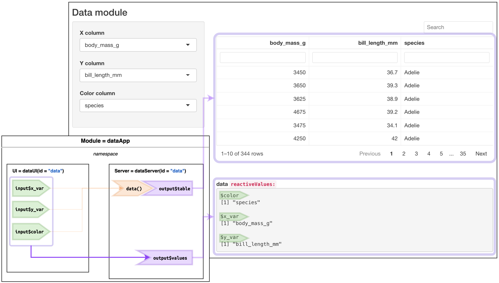

```{r setup, include=FALSE}
# xaringan::inf_mr() ----
# xaringan::inf_mr()
library(knitr)
library(rmdformats)
library(tidyverse)
library(devtools)
library(hrbrthemes)
library(fs)
library(shiny)
library(reactable)
# figs folder
fs::dir_create('img')
# Global options
knitr::opts_chunk$set(
  # cache = FALSE # cache data
  echo = TRUE, # show/hide all code
  # results = "hide", # hide results
  tidy = FALSE, # cleaner code printing
  comment = "#> ", # better console printing
  eval = TRUE, # turn this to FALSE stop code chunks from running
  message = TRUE, # show messages
  warning = FALSE, # show warnings
  size = "tiny", # size of the text
  fig.path = "images", # location of figure files
  fig.height = 7.5, # height of figures
  fig.width = 10 # width of figures
) 
# knit options
knitr::opts_knit$set(
  width = 78,
  progress = FALSE
)
# base options
base::options(
  tibble.print_max = 25,
  tibble.width = 78,
  max.print = 999999,
  scipen = 100000000
)
```

<br>


# Part 1) data UI module 

Below is the function for the `dataUI()`. As you can see, `dataUI()` has the same three `inputId` values (`"x_var"`, `"y_var"`, and `"color"`) as `plotUI()`, but I've added some layout functions. 

Once again, I used the `verbatimTextOutput()` function again to print the `reactiveValues` in the UI.

```{r dataUI}
dataUI <- function(id) {
  tagList(
    sidebarLayout(
      sidebarPanel(
        # x variable
        selectInput(
          inputId = NS(namespace = id, id = "x_var"),
          label = "X column", selected = "body_mass_g",
          choices = names(palmerpenguins::penguins)
        ),
        # y variable
        selectInput(
          inputId = NS(namespace = id, id = "y_var"),
          label = "Y column", selected = "bill_length_mm",
          choices = names(palmerpenguins::penguins)
        ),
        # color
        selectInput(
          inputId = NS(namespace = id, id = "color"),
          label = "Color column", selected = "species",
          choices = names(palmerpenguins::penguins)
        )
      ),
      mainPanel(
        # table
        reactableOutput(
          outputId =
            NS(namespace = id, id = "table")
        ),
        # some space
        br(), br(), br(),
        # values
        tags$strong("data ", tags$code("reactiveValues:")),
        verbatimTextOutput(
          outputId =
            NS(namespace = id, id = "value")
        )
      )
    )
  )
}
```

# Part 2) data server module

Below the server module selects in the columns from the `selectInput()`s and displays them with `renderReactable()`.  I've also used the `data()` reactive for the table display.

```{r dataServer}
# dataServer ----------------------------------------
dataServer <- function(id) {
  moduleServer(id = id, module = function(input, output, session) {
    # data
    data <- reactive(
      select(
        palmerpenguins::penguins,
        all_of(c(input$x_var, input$y_var, input$color))
      )
    )

    # table display
    output$table <- reactable::renderReactable({
      reactable::reactable(
        data = data(),
        # reactable settings ------
        defaultPageSize = 10,
        resizable = TRUE,
        highlight = TRUE,
        height = 350,
        wrap = FALSE,
        bordered = TRUE,
        searchable = TRUE,
        filterable = TRUE
      )
    })

    # reactive values
    output$value <- shiny::renderPrint({
      all_values <- reactiveValuesToList(x = input, 
                                         all.names = TRUE)
      values <- all_values[str_detect(names(all_values), "reactable", TRUE)]
      print(values)
    })
  })
}

```

# Part 3) The app

Finally, we create a quick demo function to test our app: 

```{r dataApp}
dataApp <- function() {
  ui <- fluidPage(
    br(),
    h3("Data module"),
    dataUI(id = "data"),
  )

  server <- function(input, output, session) {
    dataServer(id = "data")
  }

  shinyApp(ui, server)
}

dataApp()
```

The application is deployed here: 

# Module 2) dataApp reactive graph

Below is another adapted reactive graph for this module. We can see the shared `id` between the UI and server is `"data"`, and the  `reactiveValues` show the columns displayed in the inputs:

```{r dataDemo-reactiveValues-png, echo=FALSE, eval=TRUE}

```
