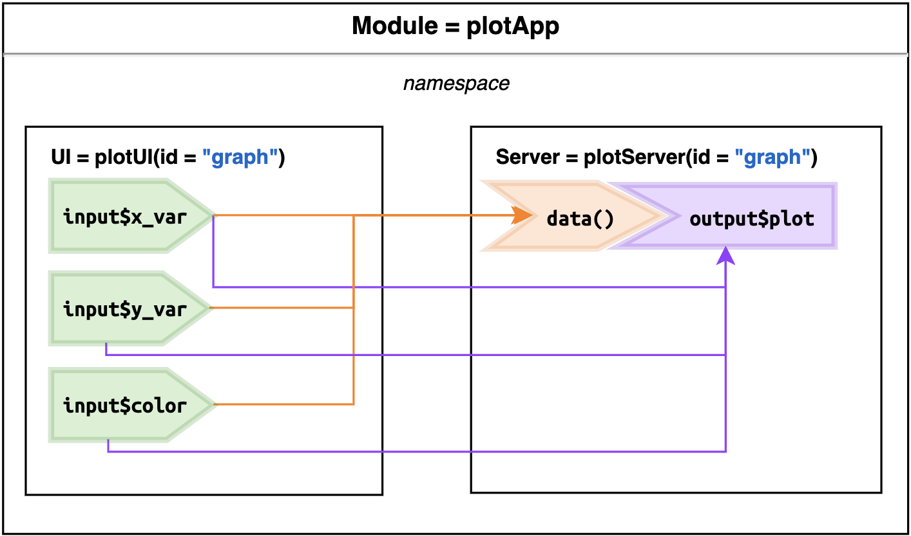

```{r setup, include=FALSE}
# xaringan::inf_mr() ----
# xaringan::inf_mr()
library(knitr)
library(rmdformats)
library(tidyverse)
library(devtools)
library(hrbrthemes)
library(fs)
library(shiny)
library(reactable)
# figs folder
fs::dir_create('img')
# Global options
knitr::opts_chunk$set(
  # cache = FALSE # cache data
  echo = TRUE, # show/hide all code
  # results = "hide", # hide results
  tidy = FALSE, # cleaner code printing
  comment = "#> ", # better console printing
  eval = TRUE, # turn this to FALSE stop code chunks from running
  message = TRUE, # show messages
  warning = FALSE, # show warnings
  size = "tiny", # size of the text
  fig.path = "images", # location of figure files
  fig.height = 7.5, # height of figures
  fig.width = 10 # width of figures
) 
# knit options
knitr::opts_knit$set(
  width = 78,
  progress = FALSE
)
# base options
base::options(
  tibble.print_max = 25,
  tibble.width = 78,
  max.print = 999999,
  scipen = 100000000
)
```

<br>

# Part 1) plot UI module 

For the UI module, I defined the UI function below with a single `id` argument, and use `tagList()` so our inputs play well with the layout functions (like `fluidPage()`, `sidebarLayout()`, etc.).

I use two numeric variables for the `x` and `y` aesthetics (as `"x_var"` and `"y_var"`), and a single factor variable for the `color` aesthetic (as `"color"`).  I will also create a `values` input for the `reactiveValues`.


```{r plotUI}
plotUI <- function(id) {
  tagList(
    # x variable
    selectInput(
      inputId =
        NS(namespace = id, id = "x_var"),
      label = "X column", 
      selected = "body_mass_g",
      choices = names(
        select(
          palmerpenguins::penguins, where(is.numeric)
        )
      )
    ),
    # y variable
    selectInput(
      inputId =
        NS(namespace = id, id = "y_var"),
      label = "Y column", 
      selected = "bill_length_mm",
      choices = names(
        select(
          palmerpenguins::penguins, 
          where(is.numeric)
        )
      )
    ),
    # color
    selectInput(
      inputId =
        NS(namespace = id, id = "color"),
      label = "Color column", selected = "species",
      choices = names(
        select(palmerpenguins::penguins, 
               where(is.factor))
      )
    ),
    # plot
    plotOutput(
      outputId =
        NS(namespace = id, id = "plot")
    ),
    # values
    verbatimTextOutput(
      outputId =
        NS(namespace = id, id = "value")
    )
  )
}
```

# Part 2) Plot server module

Next I built the server module (`plotServer()`) which also takes an `id` argument, but inside this function, `id` is inherited by `moduleServer()`. 

The `moduleServer()` also has a `module()` arguemnt, which is similar to the standard shiny server function (i.e. it has `input`, `output`, `session`):


```{r plotServer}
plotServer <- function(id) {
  # create module
  moduleServer(id = id, module = function(input, output, session) {
    # data
    data <- reactive(
      select(
        palmerpenguins::penguins,
        all_of(c(input$x_var, input$y_var, input$color))
      )
    )
    # plot
    output$plot <- renderPlot({
      # y labels
      y_lab <- str_replace_all(input$y_var, "_", " ")
      # x labels
      x_lab <- str_replace_all(input$x_var, "_", " ")
      # graph
      ggplot(data()) +
        geom_point(
          aes_string(
            x = input$x_var,
            y = input$y_var,
            color = input$color
          )
        ) +
        labs(
          title =
            paste0("Histogram of ", x_lab, " and ", y_lab),
          x = x_lab,
          y = y_lab
        )
    })
    # reactive values
    output$value <- renderPrint({
      # these will change as inputs change!
      values <- reactiveValuesToList(x = input, 
                                    all.names = TRUE)
      print(values)
    })
  })
}
```

I also include another `reactiveValuesToList()` function to print the `reactiveValues`.

# Part 3) The app 

Finally, I created `plotMod()` for running the `plotUI()` and `plotServer()` modules. I linked the UI and server functions with identical `id` arguments (`"graph"`).

```{r plotMod}
plotMod <- function() {
    
  ui <- fluidPage(
    # some space
    br(), br(),
    # plot ui module
    plotUI(id = "graph"),
  )

  server <- function(input, output, session) {
    # plot output module
    plotServer(id = "graph")
  }

  shinyApp(ui, server)
  
}

plotMod()
```

This application is deployed here: 

https://mjfrigaard.shinyapps.io/02-plotMod/

# Reactive graph

I've adapted the reactive graph to reflect how the `plotUI()` & `plotServer()` module works. The **Producers** (green `$input` values) are in the UI function, and the reactives (orange expressions) and **Consumers** (purple `$output` values) are in the server function:

<!-- images/module.png -->

```{r module-png, echo=FALSE, eval=TRUE}

```

As you can see from this figure, the `plotUI()` and `plotServer()` link the UI to the server via the shared `id` (`"graph"`). The module creates a namespace that contains all the inputs and outputs.

Below is an adapted reactive graph for the inputs, reactives, and outputs used to create the graph in `plotMod()`:

```{r plotDemo-module-graph-png, echo=FALSE, eval=TRUE}

```

The three `inputId` values (`input$x_var`, `input$y_var`, and `input$color`) are used to create the `data()` reactive:

```r
data <- reactive(
          select(palmerpenguins::penguins,
            all_of(c(input$x_var, input$y_var, input$color))))
```

These `inputId`s are also used directly in the `output$plot` as:

```r
geom_point(
    aes_string(x = input$x_var, 
               y = input$y_var, 
               color = input$color))
```

Collectively, these create the following in the UI:

```{r plotDemo.png, echo=FALSE, eval=TRUE}

```

# Reactive values 

However, recall I also included the `reactiveValuesToList()` function, which prints the `reactiveValues` (and the inputs) the UI. This is not necessary for the plot to render, but I've included it here to show what inputs are available in this namespace:

```{r plotDemo-reactiveValues.png, echo=FALSE, eval=TRUE}

```

The output shows the three `input` values I am using in the `data()` reactive (and graph). If we change the variables in the `selectInput()`, the values change in the `renderPrint()` function.

The figure above is meant to illustrate how modules create namespaces that can share inputs, reactives, and outputs. I can extend this example by adding another module to the application for displaying the data in a [reactable](https://glin.github.io/reactable/index.html) table. 
